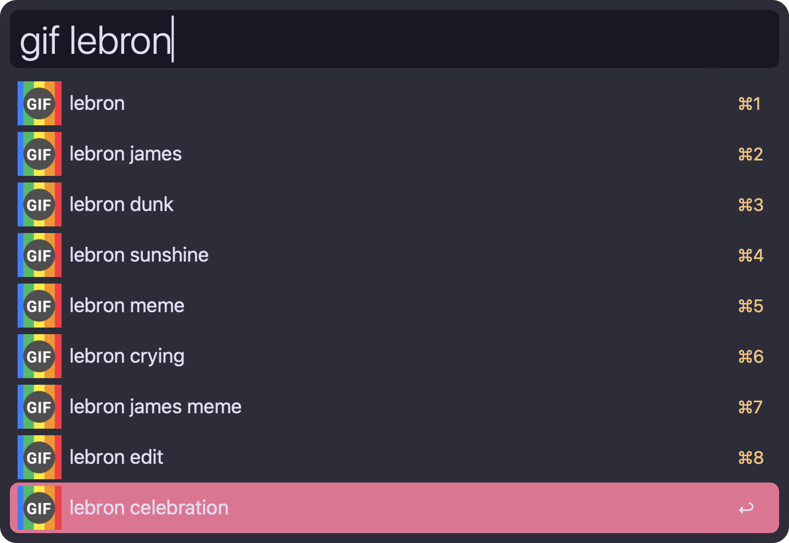
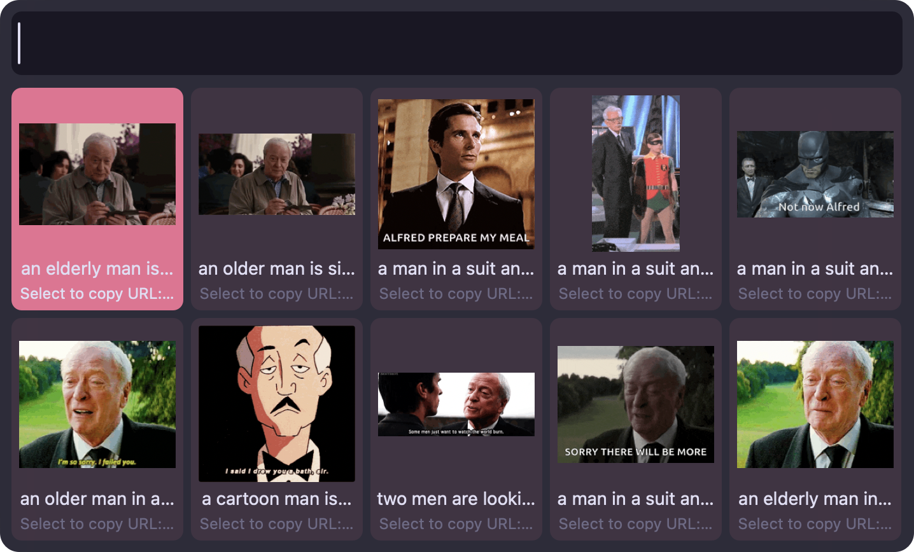

#  Gif Search Alfred Workflow

Search and download GIFs using Tenor’s API in a grid view.

## Setup

1. Obtain a Tenor API Key  
   • Visit https://developers.google.com/tenor/guides/quickstart and sign in or register.  
   • Return to the quickstart page, and click "Get a Key"
   • Create a project from the dropdown
   • Copy the key from "SHOW KEY" result

2. Configure the workflow  
   • Open **Alfred Preferences → Workflows → Gif Search**.  
   • In the workflow’s **Variables** pane, set:
     – **API_KEY**: Your Tenor API Key  
     – **MAX_RESULTS**: Number of preview items (1–50, default 10)  
     – **PREVIEW_QUALITY**: Low (nanogif), Medium (tinygif), High (gif)  
     – **GIF_QUALITY**: Low (nanogif), Medium (tinygif), High (gif), Video (mp4)  

## Usage

Type `gif <search terms>` to fetch previews:

In the grid:  
• <kbd>↩︎</kbd> on an item → downloads and copies to clipboard  
• <kbd>⌘↩︎</kbd> → open in browser
• Arrow keys → navigate  

## Quality & Network Considerations

Tenor offers many formats; this workflow exposes four common ones:

| Format   | Type           | Dimensions                     | Median Size | Ideal Use                           |
|----------|----------------|--------------------------------|-------------|-------------------------------------|
| nanogif  | GIF (smallest) | up to 90 px tall               | ~56 KB      | Low-bandwidth mobile previews       |
| tinygif  | GIF (small)    | up to 220 px wide              | ~101 KB     | Mobile previews & lightweight shares|
| gif      | GIF (full)     | original upload dimensions     | ~956 KB     | Desktop shares, high-bandwidth      |
| mp4      | Video (single) | padded to 8 px video increments| ~91 KB      | Desktop video shares, fast loading  |

• For **mobile/low-bandwidth**, choose **nanogif** or **tinygif**.  
• For **desktop/high-bandwidth**, choose **gif** or **mp4** (Video).  
• Higher quality increases file size and load time.  

For full details on all formats (WebM, loopedmp4, WebP, etc.), see Tenor’s docs:  
https://developers.google.com/tenor/guides/response-objects-and-errors#content-formats

## License

MIT. Contributions welcome via GitHub PRs or issues.
